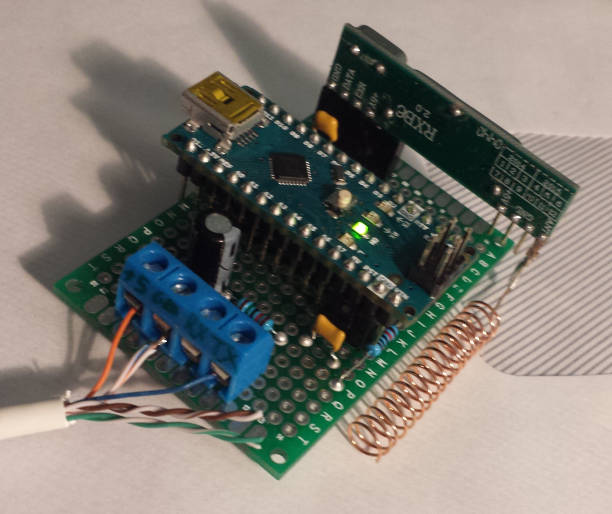

# SerialOregon

This component is a small addon to receive Oregon Scientific sensors.

It uses an Arduino to decode the signals and send the data over Serial port. A bash script is provided to parse the JSON output on the serial port and write the output into a bash readable file.



## Parts needed 

 - one Arduino
 - one RF 433Mhz receiver (find some cheap on chinese retailer)
 - one antenna : a 17.2cm straight wire will do a good job
 - two resistors (10k and 15k) as a voltage dividor if you're using a 3.3V UART
 - few capacitors to reduce noise on the power line

I recommend to put the Arduino away from any computer as the enviromnental noise will reduce a lot the range of the receiver.

## Schematics


```
                      VCC
                       +
                       |  .---------.
       VCC             o--o Vin  TX o---o
        +         220nF|  |         |  .-.
        |  .------.   --- |         |  | |10k
        |  |      |   --- |         |  | |
        +--o Vin  |    |  | Gnd     |  '-'
        |  |      |    o--o         |   o-------------o TX
  10nF --- |433Mhz|   === | Arduino |   |
       --- | Rec  |   GND |         |  .-       VCC
        |  |      |       |         |  | |       o----o 5V
        |  |  Datao-------o D2      |  | |15k    |
        +--o Gnd  |       |         |  '-'      ---
        |  '------'       '---------'   |       ---
        |                               |  220uF o----o GND
       ===                             ===      ===
       GND                             GND      GND

```

## Usage

Once you uploaded the sketch to the Arduino, plug it to a serial port and a 5V power supply. If you're using a Raspberry Pi, don't forget to add a voltage dividor to bring the serial TX to 3.3V as the Arduino runs on 5V.
You can also use the USB link for both data and power if you don't want to use a plain serial port.

You should then see the received data on the serial port (speed 9600 Bauds) : 

```
minicom -D /dev/ttyS1
{ "channel": "2", "temp": "17.40", "hum": "40" }
```

This receiver has been tested with THGN132N and THN132N sensors.

## Other solutions

I tried to handle the decoding directly on a Rasberry Pi using one pin to detect change of the signal with interruption. It's working but the range was reduce a lot compared to the arduino receiver and the decoding process is very CPU intensive.

If you're interested by this technique, see https://www.disk91.com/2013/technology/hardware/oregon-scientific-sensors-with-raspberry-pi/

